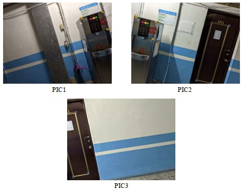
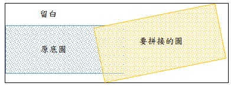
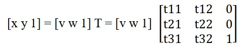
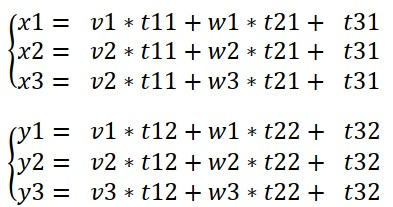
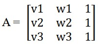
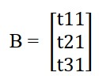
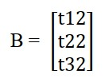
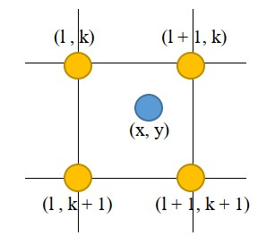
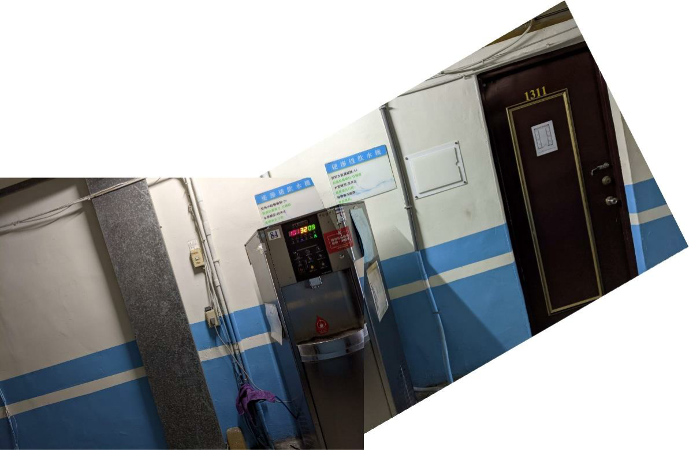
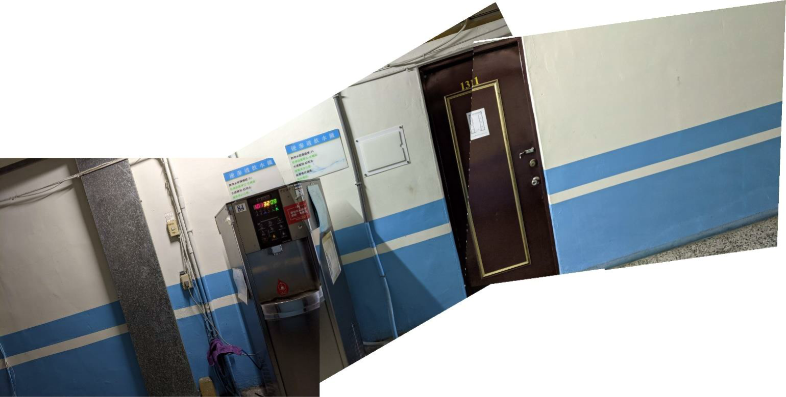

# HW1 Image Stitching
## 作業簡介
此作業主要目的為透過Affine Transform 實作影像拼接的效果，步驟如下： 
1. 拍攝三張照片 
2. 相鄰的照片倆倆取出各3 點對應點 
3. 運用Inverse Mapping 調整影像 
4. 進行影像拼接，達成全景圖效果

## 實做內容
* 說明
  程式語言：Python  
  使用到的函式庫：Pillow (圖片讀去、各pixel 處理)、Numpy (矩陣處理)  
  使用原圖：  
  4032 × 3024，經FastStone Image Viewer 縮小到1624 × 1218 (減省時間)  
  圈起來的地方是連接基準作標(人工標記) 
  
* 重要程式碼
  * 主程式
    ```
    # 讀取圖檔
    PIC1 = img.open("PIC1.jpg")
    PIC2 = img.open("PIC2.jpg")
    PIC3 = img.open("PIC3.jpg") 
    # 每張圖要和下一張圖的拼接點
    PIC1_points = [[1177, 233], [1490, 136], [1563, 400]]
    PIC2_points_l = [[62, 215], [366, 287], [316, 549]]
    PIC2_points_2 = [[1466, 341], [1197, 1207], [967, 1173]]
    PIC3_points  = [[132, 195], [316, 1119], [85, 1178]]    
    # 每張圖片的角落四點
    PIC1_corners = [[0, 0], [PIC1.size[0], 0], [0, PIC1.size[1]], [PIC1.size[0], PIC1.size[1]]]
    PIC2_corners = [[0, 0], [PIC2.size[0], 0], [0, PIC2.size[1]], [PIC2.size[0], PIC2.size[1]]]
    PIC3_corners = [[0, 0], [PIC3.size[0], 0], [0, PIC3.size[1]], [PIC3.size[0], PIC3.size[1]]] 
    # 兩張兩張作拼接
    PIC12 = stitch(PIC1, PIC2, PIC1_points, PIC2_points_l, PIC1_corners, PIC2_corners, PIC2_points_2, "output/PIC1+PIC2.jpg")
    PIC12_corners = [[0, 0], [PIC12.size[0], 0], [0, PIC12.size[1]], [PIC12.size[0], PIC12.size[1]]]
    stitch(PIC12, PIC3, PIC2_points_2, PIC3_points, PIC12_corners, PIC3_corners, None, "output/PIC1+PIC2+PIC3.jpg")
    ```
    PIC1 接 PIC2 座標：(1177, 233), (1490, 136), (1563, 400)  
    PIC2 接 PIC1 座標：(62, 215), (366, 287), (316, 549)  
    PIC2 接 PIC3 座標：(1466, 341), (1197, 1207), (967, 1173)  
    PIC3 接 PIC2 座標：(132, 195), (316, 1119), (85, 1178) 

  * stitch：實作影像拼接的部分
    * 函式參數部分：
      ```
      # 做影像拼接，用 Inverse Mapping 達成
      # stitch(底圖, 要拼上去的圖, 底圖對應到要拼接的圖的3個點, 要拼接的圖對應到底圖的3個點, 
      #        底圖角落四點座標, 要拼接的圖角落四點座標, 要拼接的圖對應要再拼接的下一張圖的3個點, 拼接結果圖檔名稱)
      def stitch(img1, img2, points1, points2, img1_corners, img2_corners, next_points, out_name):
      ```
    * 前置作業，求出 Affine Matrix、拼接後的圖片大小、各點座標：
      ```
      T = MatrixT(points1, points2)                                       # 求出 Affine Matrix
      ori_max_x, ori_max_y = img2_corners[3][0], img2_corners[3][1]       # 要拼接的圖的長、寬
      img1__x, img1_y = img1_corners[3][0], img1_corners[3][1]            # 底圖的長、寬

      # 以底圖為基準，求出 要拼接的圖的四點 對應到底圖的座標
      for i in range(4):
          temp = np.array([img2_corners[i][0], img2_corners[i][1], 1]).dot(T)
          for j in range(2):
              if temp[j] - int(temp[j]) > 0:
                  img2_corners[i][j] = int(temp[j]) + 1
              else:
                  img2_corners[i][j] = int(temp[j])
      
      # - min_x, min_y, max_x, max_y 表示以底圖左上角為基準(0, 0)時，
      #   加上經 Affine Transform 後的 要拼接的圖，所產生的新的四邊座標軸
      # - 可以求出拼接後的圖形該有的長、寬
      min_x = min(img2_corners[0][0], img2_corners[1][0], img2_corners[2][0], img2_corners[3][0])
      if min_x > 0:
          min_x = 0
      max_x = max(img2_corners[0][0], img2_corners[1][0], img2_corners[2][0], img2_corners[3][0])
      if max_x < img1__x:
          max_x = img1__x
      min_y = min(img2_corners[0][1], img2_corners[1][1], img2_corners[2][1], img2_corners[3][1])
      if min_y > 0:
          min_y = 0
      max_y = max(img2_corners[0][1], img2_corners[1][1], img2_corners[2][1], img2_corners[3][1])
      if max_y < img1_y:
          max_y = img1_y
      
      fullImg = img.new("RGB", (max_x - min_x, max_y - min_y), "White")
      ```
    * 將圖片"上色"
      ```
      # 對底圖著色 這邊分為"要拼接的圖" 和 "原底圖" 兩部分(所以才從 min_x, min_y 兩個可能是負的值開始)
      # Inverse Mapping: 從結果的點(做完 Affing Transform 後)找回原本轉置前的點
      for x in range(min_x, max_x - min_x - 1):
          for y in range(min_y, max_y - min_y - 1):
              ori_point = np.array([x, y, 1]).dot(np.linalg.inv(T))   # 對 (x, y) 做 Inverse Mapping

              # 如果 ori_point 可以對應到原本要拼接的圖的座標，代表該點為"要拼接的圖"的部分
              if (ori_point[0] >= 0 and ori_point[0] <= ori_max_x - 1) and (ori_point[1] >= 0 and ori_point[1] <= ori_max_y - 1):
                  val = bilinear(ori_point[0], ori_point[1], img2)    # 找到 ori_point 對應回原要拼接的圖的位置後，做 Binlnear Interpolation
                  fullImg.putpixel((x - min_x, y - min_y), (val[0], val[1], val[2]))
              # 不然，如果(x, y) 可以對應到原底圖的新位置，代表該點為 "原底圖"的部分
              elif (x >= -min_x and x <= img1__x - min_x - 1) and (y >= -min_y and y <= img1_y - min_y - 1):
                  fullImg.putpixel((x, y), (img1.load()[x + min_x, y + min_y]))
              # 否則，代表 (x, y) 不屬於任何人(留白)
              else:
                  continue
      fullImg.save(out_name)
      ```
    * 拼裝結果示意圖如下：
      
    * 如果有要接下一張圖，把座標修改呈現在拼裝後的座標
      ```
      # 如果要拼接的圖還有要再繼續往蝦接人，把原本的拼接座標(自己還未被拼接)改成現在(自己被拼接後)的座標
      if next_points:
          for i in range(3):
              temp = np.array([next_points[i][0], next_points[i][1], 1]).dot(T)
              if temp[0] - int(temp[0]) > 0:
                  next_points[i][0] = int(temp[0]) + 1 - min_x
              else:
                  next_points[i][0] = int(temp[0]) - min_x

              if temp[1] - int(temp[1]) > 0:
                  next_points[i][1] = int(temp[1]) + 1 - min_y
              else:
                  next_points[i][1] = int(temp[1]) - min_y
      ```

  * MatrixT：求出 Affine Matrix T
    這邊直接使用了講義的公式，其中 z<sub>5</sub> 表示當前pixel，其他為 3 × 3 空間中的相對位置：MatrixT
    ```
    def MatrixT(imgStay_points, imgMove_points):
    # 用numpy解聯立方程式
    # ref: 使用 Python 解線性聯立方程組 by Yao-Jen Kuo. on Medium
    # A * X = B => X = (A^-1) * B
    A = np.array([
        [imgMove_points[0][0], imgMove_points[0][1], 1],
        [imgMove_points[1][0], imgMove_points[1][1], 1],
        [imgMove_points[2][0], imgMove_points[2][1], 1],
    ])
    # 求 t11, t21, t31
    B = np.array([imgStay_points[0][0], imgStay_points[1][0], imgStay_points[2][0]]).reshape(3, 1) 
    A_inv = np.linalg.inv(A)
    X1 = A_inv.dot(B).reshape(1, 3)[0]

    # 再做一次，這次求 t12, t22, t32
    B = np.array([imgStay_points[0][1], imgStay_points[1][1], imgStay_points[2][1]]).reshape(3, 1)
    A_inv = np.linalg.inv(A)
    X2 = A_inv.dot(B).reshape(1, 3)[0]

    return np.array([[X1[0], X2[0], 0], [X1[1], X2[1], 0], [X1[2], X2[2], 1]])
    ```
    令 (x, y) 為轉置後座標，(v, w)為原座標，T 為 Affine Matrix 
    
    把原影像的三個點(v1, w1), (v2, w2), (v3, w3)分別帶進去，得：
    
    而程式當中
    
    第一個 B：
    
    第二個B：
    
  * bilinear ：實作雙線性差值法
    ```
    def bilinear(x, y, img):
    l = int(x)
    k = int(y)
    a = x - int(x)
    b = y - int(y)
    return_pixel = [0, 0, 0]
    # 每個點依照各自的權重，把 RGB 值賦予給(x, y)
    for i in range(3):
        return_pixel[i] = int((1 - a) * (1 - b) * img.load()[l, k][i] + a * (1 - b) * img.load()[l + 1, k][i] + \
                              (1 - a) * b * img.load()[l, k + 1][i] + a * b * img.load()[l + 1, k + 1][i])
    # 回傳結果即為變形後的點的 RGB 值
    return return_pixel
    ```
    示意圖：
    

## 結果
1. PIC1 + PIC2 (3074 * 2013) 
   
2. (PIC1 + PIC2) + PIC3 (3995 * 2022) 
   