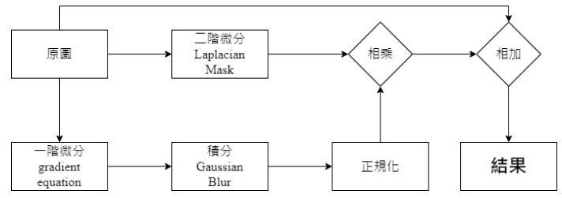
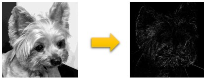
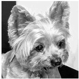
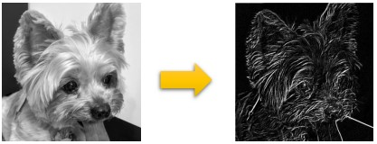
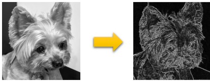
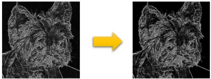
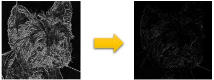
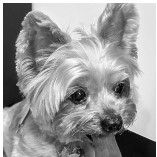
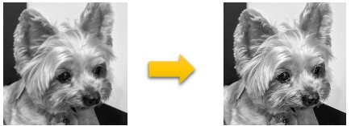

# HW2 Image Enhancement
## 作業簡介
此作業主要目的為”捲積”的實作，步驟如下： 
1. 將原圖做二階微分 (Laplacian Mask) 捲積運算 
2. 將原圖做一階微分 (Sobel 捲積 / gradient equation 公式) 
3. 將 3 模糊(積分)，去除雜訊 (Gaussian Blur 捲積) 
4. 將 4 正規化 (0 – 255 便 0 - 1) 並乘上 1 
5. 5 加上原圖，即可得到銳化圖片 


## 實做內容
* 說明
  程式語言：Python  
  使用到的函式庫：Pillow、Numpy、OpenCV  
  使用原圖：512 * 512 圖片如下  
  
* 重要程式碼
  * 前置：使用捲積的各個 mask
    分別為：二階微分、Sobel 水平邊緣、Sobel 垂直邊緣、高斯模糊
    ```
    Laplacian_mask = [[-1, -1, -1], [-1, 8, -1], [-1, -1, -1]] 
    sobel_hor_mask = [[1, 0, -1], [2, 0, -2], [1, 0, -1]]
    sobel_ver_mask = [[1, 2, 1], [0, 0, 0], [-1, -2, -1]]
    GaussianBlur_mask = [[1 / 16, 2 / 16, 1 / 16], [2 / 16, 4 / 16, 2 / 16], [1 / 16, 2 / 16, 1 / 16]]
    ```
  * 捲機函式
    ```
    # 實作捲積
    def convolution(image_name, mask, img_w, img_h, out_name):
        out_p = padding(image_name, img_w, img_h)
        out_img = cv2.imread(image_name, 0)        # 要輸出的圖，用 imread 只是為了取出影像格式

        # 用 padding 後的圖跟 mask 做捲積，把每個 pixel 運算結果傳給輸出影像的對應位置
        for i in range(1, img_h + 1):
            for j in range(1, img_w + 1):
                # cur 紀錄該 pixel 的捲積結果
                cur = 0
                cur += out_p[i - 1, j - 1] * mask[0][0] # 左上
                cur += out_p[i - 1, j] * mask[0][1]     # 中上
                cur += out_p[i - 1, j + 1] * mask[0][2] # 右上
                cur += out_p[i, j - 1] * mask[1][0]     # 中左
                cur += out_p[i, j] * mask[1][1]         # 正中
                cur += out_p[i, j + 1] * mask[1][2]     # 中右
                cur += out_p[i + 1, j - 1] * mask[2][0] # 左下
                cur += out_p[i + 1, j] * mask[2][1]     # 中下
                cur += out_p[i + 1, j + 1] * mask[2][2] # 右下

                # 因為灰階是在 0 ~ 255 之間，超過的要把他們抓回來
                if cur > 255:
                    out_img[i - 1, j - 1] = 255
                elif cur < 0:
                    out_img[i - 1, j - 1] = 0
                else:
                    out_img[i - 1, j - 1] = int(cur)    # 這邊要把數值轉回整數
        # 輸出影像
        cv2.imwrite(out_name, out_img)
        return out_img
    ```
    註：下半部的判斷 cur 是否超過 0 – 255 的動作其實滿重要的  
    (我原本忘記放這個，結果輸出的影像多了很多雜訊…… )
  * 一階微分 – 運用gradient equation 
    ```
    # 用 gradient equation 公式計算邊緣
    def find_edge(image_name, img_w, img_h, out_name):
        out_image = cv2.imread(image_name, 0)
        out_p = padding(image_name, img_w, img_h)

        for i in range(1, img_h + 1):
            for j in range(1, img_w + 1):
                out_image[i - 1, j - 1] = (abs((out_p[i + 1, j - 1] + 2 * out_p[i + 1, j] + out_p[i + 1, j + 1]) - 
                                            (out_p[i - 1, j - 1] + 2 * out_p[i - 1, j] + out_p[i - 1, j + 1])) +
                                        abs((out_p[i - 1, j + 1] + 2 * out_p[i, j + 1] + out_p[i + 1, j + 1]) - 
                                            (out_p[i - 1, j - 1] + 2 * out_p[i, j - 1] + out_p[i + 1, j - 1])))
        
        cv2.imwrite(out_name, out_image)
        return out_image
    ```
    這邊直接使用了講義的公式，其中 z<sub>5</sub> 表示當前 pixel，其他為 3 × 3 空間中的相對位置:  
    
  * 影像正規化函式
    ```
    # 做影像正規化 ex: 灰階影像的 0 ~ 255 轉成 0 ~ 1
    # num 表示原來的區間大小
    def normalization(img, num, img_w, img_h):
        out = []

        for i in range(img_h):
            out.append([])
            for j in range(img_w):
                out[i].append(float(img[i, j] / num))

        return out
    ```
  * 影像”相加”函式
    ```
    # 做影像"相加"
    def add(img1, img2, img_w, img_h, out_name):
        out_image = img1.copy()
        # 相加時，要把大於 255 的變回 255，小於 0 的變回 0
        for i in range(img_h):
            for j in range(img_w):
                if int(img1[i, j]) + int(img2[i, j]) >= 255:
                        out_image[i, j] = 255
                elif int(img1[i, j]) + int(img2[i, j]) <= 0:
                        out_image[i, j] = 0
                else:
                    out_image[i, j] = int(img1[i, j]) + int(img2[i, j])

        cv2.imwrite(out_name, out_image)
        return out_image
    ```
  * 正規化影像和其他影像”相乘”函式 
    ```
    # 做影像 和 正規化影像 "相乘"   
    def multipy(img, img_normal, img_w, img_h, out_name):
        out_image = img.copy()

        for i in range(img_h):
            for j in range(img_w):
                if int(img[i, j] * img_normal[i][j]) >= 255:
                    out_image[i, j] = 255
                elif int(img[i, j] * img_normal[i][j]) <= 0:
                    out_image[i, j] = 0
                else:
                    out_image[i, j] = int(img[i, j] * img_normal[i][j])

        cv2.imwrite(out_name, out_image)
        return out_image
    ```

## 結果 => 依步驟逐步來看
1. 第一步：將原圖做 Laplacian Mask 捲積
     
   看似已經把細節標示出來，然而，如果我們把它和原圖相加：  
     
   可以看到其實有很多雜訊在上面(所以才需要後面的步驟！)  
2. 第二步：將原圖做一階微分
   方法1. 用Sobel Mask 做捲積  
     
   方法2. 用gradient equation 公式  
     
   一階微分的目的在於”取出邊緣”。可以看到方法2 多出了很多細節。  
    (而且老師說以他的經驗也是方法2 較優..) 所以我採方法2 的圖繼續。  
3. 第三步：將一階微分結果做 Gaussian Blur 捲積
     
   模糊的主要目的：去除雜訊。  
   取一階微分的同時，可能一些細微的雜訊也跟著被放大了，所以這邊透過模糊在把它變回去。
4. 第四步：將模糊結果正規化，並乘上原圖做 Laplacian Mask 之結果 
     
   這樣就可以留下真正式細節的部份  
5. 第五步：將強化的線條加到原圖上 
     
   得到結果～ 
* 最終比較：
    